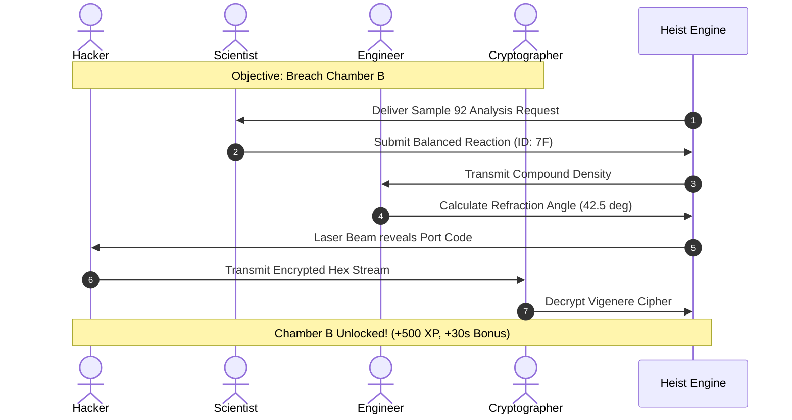
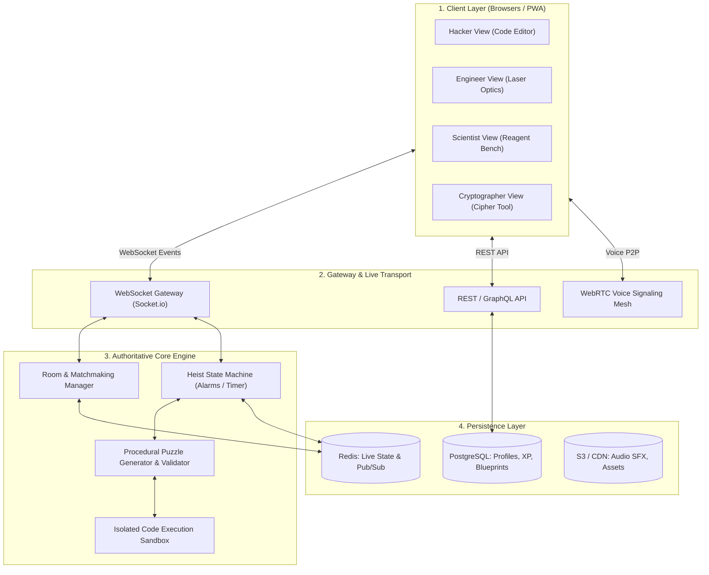
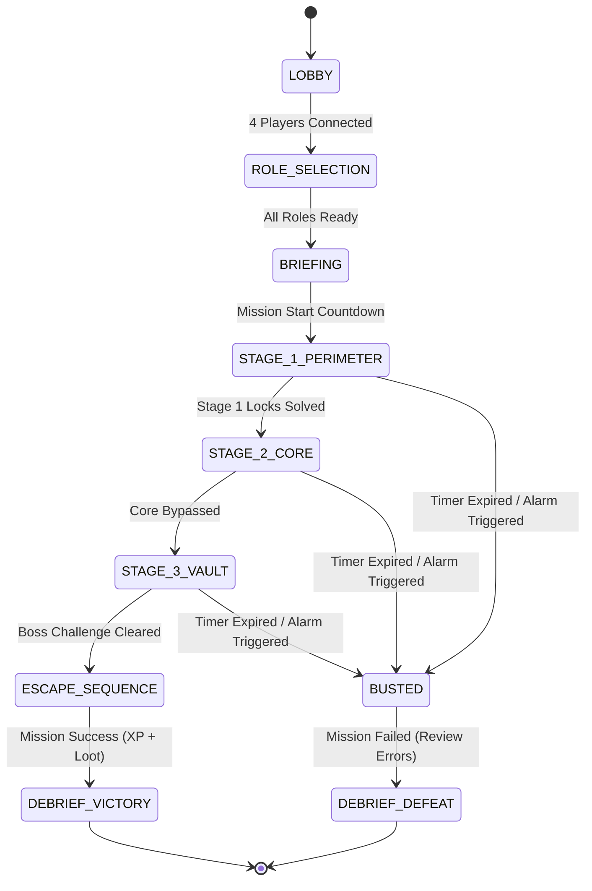

# V.A.U.L.T (Virtual Academic Underground Learning Team)
### Real-Time Multiplayer Learning Heist • Technical Specification & Pedagogical Report
**Official Live Application:** [https://vaults.vercel.app](https://vaults.vercel.app)

---

## 1. Executive Summary & Vision

### 1.1 Vision Statement
**V.A.U.L.T** (*Virtual Academic Underground Learning Team*) is a real-time, role-based multiplayer educational platform where teams of 3–4 players execute high-stakes virtual "heists" by solving interconnected, subject-specific puzzles across four core disciplines: **Computer Science & Logic**, **Mathematics & Physics**, **Natural Sciences (Chemistry/Biology)**, and **Linguistics & Cryptography**.

### 1.2 Core Pedagogical Paradigm
Unlike traditional EdTech tools that rely on solitary flashcards, rote repetition, or shallow speed quizzes, *V.A.U.L.T* transforms learning into an adrenaline-fueled cooperative mission. Players develop genuine cross-disciplinary mastery and critical soft skills (communication, peer accountability, tactical thinking) because mission progression is strictly interdependent.

---

## 2. Core Concept & Gameplay Architecture

```
                             ┌─────────────────────────┐
                             │   THE VAULT OPERATION   │
                             └────────────┬────────────┘
                                          │
                  ┌───────────────────────┼───────────────────────┐
                  ▼                       ▼                       ▼
        ┌──────────────────┐    ┌──────────────────┐    ┌──────────────────┐
        │   STAGE 1:       │    │   STAGE 2:       │    │   STAGE 3:       │
        │ Perimeter Breach │───►│ The Central Core │───►│ Vault Extraction │
        │ (Parallel Tasks) │    │(Interlocked Wire)│    │ (Boss Challenge) │
        └──────────────────┘    └──────────────────┘    └──────────────────┘
```

### 2.1 The Four Heist Roles & Subject Specializations

1. **💻 The Hacker (Infiltrator) — Computer Science & Logic**
   - **Curriculum:** Data structures, algorithms, boolean logic, recursion, API endpoints.
   - **In-Game Tooling:** Interactive coding terminal, firewall bypass consoles, routing nodes.
   - **Example Mechanic:** Writing recursive traversals and array filters to disarm security gateways.

2. **⚙️ The Engineer (Demolitions) — Mathematics & Physics**
   - **Curriculum:** Calculus, geometry, optics, mechanics, electrical circuits, trigonometry.
   - **In-Game Tooling:** Interactive laser angle grids, structural load balancers, power distribution grids.
   - **Example Mechanic:** Calculating optical refraction angles (θ = 42.5°) to reflect laser beams into sensor nodes.

3. **🧪 The Scientist (Alchemist) — Chemistry & Natural Sciences**
   - **Curriculum:** Stoichiometry, periodic trends, thermodynamics, pH balancing, cell biology.
   - **In-Game Tooling:** Chemical synthesis rigs, ventilation scrubbers, cryogenic lock controls.
   - **Example Mechanic:** Balancing molar equations to neutralize toxic ventilation gas without triggering pressure alarms.

4. **📜 The Cryptographer (Operator) — Languages & Cryptography**
   - **Curriculum:** Polyalphabetic ciphers, frequency analysis, foreign language vocabulary, historical chronology.
   - **In-Game Tooling:** RF frequency decoders, intercepted audio logs, ancient glyph translation matrices.
   - **Example Mechanic:** Cracking polyalphabetic Vigenère keys generated from historical chronology clues.

### 2.2 The "Interdependence Engine" (Why Solo Cheating Fails)

In *V.A.U.L.T*, clues and solution keys are asymmetric across roles:
- **The Asymmetric Clue Mechanic:** The Hacker sees the *encrypted ciphertext*, but only the Cryptographer possesses the *decryption formula* unlocked by linguistic analysis.
- **The Dynamic Dependency Matrix:** The Engineer's laser angle calculation depends on the *specific optical density & wavelength* discovered by the Scientist.
- **Fail-Forward Alarms:** Incorrect inputs trigger alarm escalation, audio sirens, and timer penalties (-12s), creating authentic squad pressure.



---

## 3. Comparative Advantage: Why This Crushes Existing Apps

```
             HIGH COLLABORATION / MULTIPLAYER
                            ▲
                            │
                            │     ★ V.A.U.L.T
                            │       (Multi-Subject, RPG, Live Co-Op)
                            │
           Kahoot / Quizizz │
      (Speed MCQs, Shallow) │
                            │
◄───────────────────────────┼───────────────────────────►
SINGLE-SUBJECT              │               MULTI-SUBJECT
                            │
           Duolingo         │       Khan Academy / BrainPOP
    (Solo, Streaks, Drills) │       (Solo, Passive Videos, Quizzes)
                            │
                            ▼
                       SOLO / ISOLATED
```

### 3.1 Direct Head-to-Head Comparison

| Feature Dimension | Duolingo / Memrise | Kahoot / Quizizz | Khan Academy | ★ V.A.U.L.T |
| :--- | :--- | :--- | :--- | :--- |
| **Social Dynamic** | Solo + Passive leaderboard | Competitive speed clicking | Completely solo | **Synchronous Co-Op (3-4 players)** |
| **Subject Synergy** | Language Only | Subject Silos (Isolated) | Subject Silos (Isolated) | **Integrated Cross-Disciplinary** |
| **Context & Narrative** | Out-of-context sentences | Quiz show trivia format | Passive academic lectures | **Immersive RPG Heist Storyline** |
| **Thinking Level** | Rote memorization (Recall) | Speed recall (Remember) | Conceptual understanding | **Applied Synthesis (Bloom: Analyze/Apply)** |
| **Peer Accountability** | None (personal streak) | Low (individual ranking) | None | **High (Squad progression locked)** |
| **Replay Value** | Finite course tree | Static question sets | Linear textbook drills | **Procedural Puzzle Engine + Workshop** |

---

## 4. System Architecture & Technical Wiring



### 4.2 Room State Machine & Alarm Lifecycle



---

## 5. Recommended Modern Tech Stack

| Layer | Technology | Rationale & Capability |
| :--- | :--- | :--- |
| **Frontend Core** | React / Next.js / Vite | High-performance reactive state, modular role cockpits, dynamic imports. |
| **Styling & Theme** | Vanilla CSS + Custom Tokens | Cyberpunk tactical HUD aesthetic, retro-futuristic glassmorphism, responsive grid. |
| **Visual Canvas** | HTML5 Canvas / Pixi.js | High-FPS interactive laser refraction grids, chemical pipettes, and circuit schematics. |
| **Realtime Sync** | WebSocket / Socket.io | Sub-30ms bidirectional synchronization of squad actions, lock states, and alarms. |
| **Procedural Audio** | Web Audio API | Dynamic tension synth beats (accelerating with alarms), tactile click & siren SFX. |
| **Voice Comm** | WebRTC (Simple-Peer) | In-browser squad radio channel with radio squelch filter effects. |
| **Sandbox Engine** | Pyodide & JS Isolated Sandbox | Safe instant browser-side algorithmic validation without remote latency. |
| **Database & Cache** | PostgreSQL & Redis | Relational analytics and player skill matrices paired with high-throughput Pub/Sub. |

---

## 6. Project Roadmap & Implementation Milestones

- **🚩 Milestone 1: The Interactive MVP (Weeks 1-2)**: Cyberpunk lobby, Hacker & Engineer roles, Interdependence engine prototype.
- **🚩 Milestone 2: Full 4-Role Experience (Weeks 3-4)**: Scientist & Cryptographer roles, 3-Tier Alarm System, Post-match Remediation Roadmap.
- **🚩 Milestone 3: Expansion & Polish (Weeks 5-6)**: Web Audio synth engine, WebRTC voice channels, mobile responsive touch controls.

---

## 7. Monetization & Scalability Strategy

1. **B2C Freemium / Battle Pass ("The Syndicate Pass"):** Free core expeditions + seasonal themed campaigns, cosmetic HUD themes, custom avatar items, and challenge tiers.
2. **B2B Institutional Licensing ("Heist in the Classroom"):** Teacher command dashboard, automated AP curriculum alignment, student analytics telemetry.
3. **User-Generated Content ("Heist Architect Workshop"):** Educators and puzzle designers build and publish custom mission rooms with revenue sharing.

---

## 8. Conclusion
**V.A.U.L.T** transforms education from a passive, solitary chore into an exhilarating, cooperative team sport. By merging genuine game design with rigorous academic problem solving, it occupies an uncontested blue ocean in modern EdTech.
